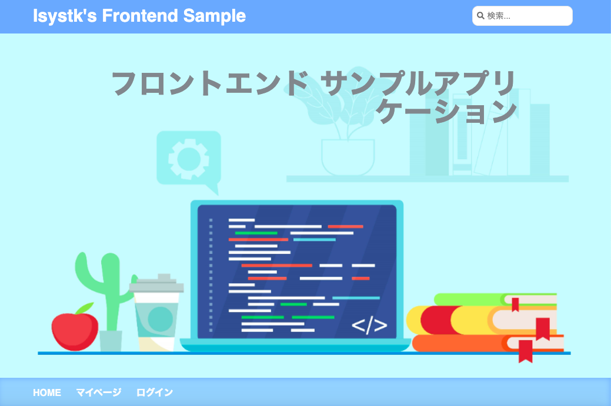

# 🌙 isystk-frontend-sample


====

## 📗 Description

Reactjs・Typescript・Gulp を利用したボイラープレートです。
1. 一覧・詳細表示
2. 画像スライダー
3. オーバーレイ
4. ドロワーメニュー
5. ログイン・ログアウト
6. 会員登録
7. パスワード忘れ
8. 投稿一覧・新規登録・修正・削除

### ディレクトリ構造
```
.
├── public (公開ディレクトリ)
│    ├── assets (Gulpで生成されたファイル)
│    │   ├── css
│    │   ├── img
│    │   └── js
│    └── index.html
├── src (React関連のソースファイル)
│    ├── images
│    ├── sass
│    └── ts
│        ├── actions
│        ├── common
│        ├── components
│        ├── interfaces
│        ├── reducers
│        ├── store
│        ├── utilities
│        └── index.tsx
├── .eslintrc.js
├── .vscode (VSCode設定ファイル)
├── gulpfile.js
├── package.json
├── tsconfig.json
└── webpack.config.ts
```

## 🖊️ VS. 

### 利用している技術
- Reactjs 16
- ReactRedux 6
- ReduxForm 8
- Typescript 6
- Gulp 4
- Webpack 5
- ESLint 7

## 🌐 Demo



## 🎨 Requirement

推奨するNodeのバージョン v13.13.0

## 💬 Usage

```bash
$ cd /path/to/isystk-frontend-sample
$ yarn run dev
```

#### 接続先情報

| 接続先| URL|
| :-----| :---------------------------------------|
| DEMO画面| http://localhost:3000/|

## 📦 Install

```bash
$ cd /path/to/isystk-frontend-sample
# node inistall
$ nodebrew install v13.13.0
# yarn inistall
$ node install -g yarn
# module inistall
$ yarn
```

## 🔧 Contribution

1. Fork it ( http://github.com/isystk/isystk-frontend-sample/fork )
2. Create your feature branch (git checkout -b my-new-feature)
3. Commit your changes (git commit -am 'Add some feature')
4. Push to the branch (git push origin my-new-feature)
5. Create new Pull Request

## 🔗 参考

| プロジェクト| 概要|
| :---------------------------------------| :-------------------------------|
| [公式ドキュメント - React.js](https://ja.reactjs.org/docs/getting-started.html)| 公式ドキュメント - React.js|
| [公式ドキュメント - Redux](https://redux.js.org/api/api-reference)| 公式ドキュメント - Redux|
| [公式ドキュメント - Redux Form](https://redux-form.com/8.3.0/docs/api/)| 公式ドキュメント - Redux Form|
| [公式ドキュメント - Material UI](https://material-ui.com/ja/getting-started/usage/)| 公式ドキュメント - Material UI|
| [公式ドキュメント - TypeScript](https://www.typescriptlang.org/docs/home)| 公式ドキュメント - TypeScript|
| [仕事ですぐに使えるTypeScript](https://future-architect.github.io/typescript-guide/)| 仕事ですぐに使えるTypeScript|
| [アイコン（fontawesome）](https://fontawesome.com/icons?d=gallery)| アイコン（fontawesome）|

## 🎫 Licence

[MIT](https://github.com/isystk/isystk-frontend-sample/blob/master/LICENSE)

## 👀 Author

[isystk](https://github.com/isystk)
